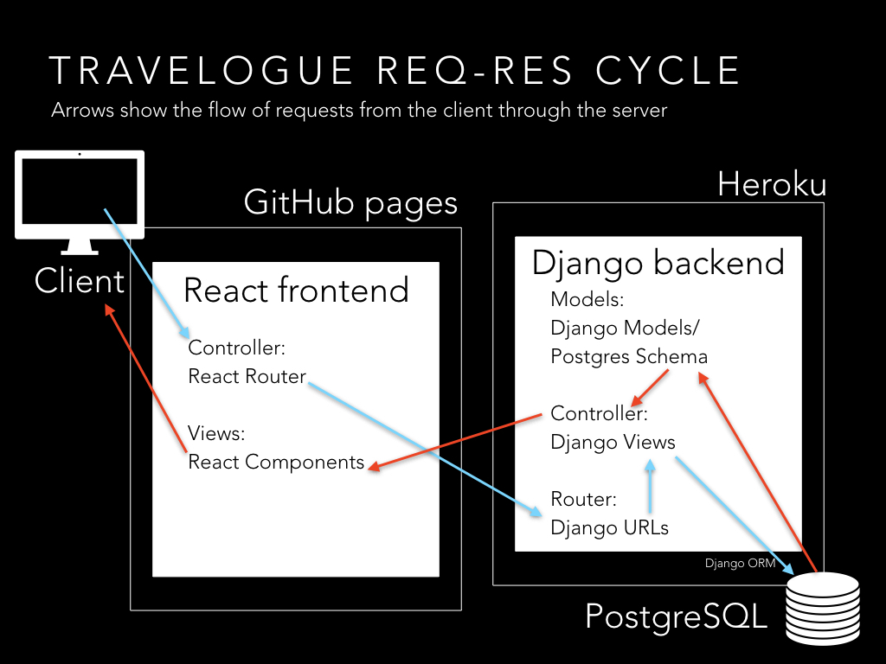

# Travelogue

## About Travelogue

As a child of parents from two different countries, I was no stranger to travel from an early age. By the time I was 19, my passport had stamps from Turkey, South Korea, France, Switzerland, Ireland, and the UK.

For the past three months, as I completed a remote software engineering bootcamp, I was tied to my home, my room, and my desk with its double monitors. And yet, even though you could usually find me in a very narrow geographic radius, I was on a journey that broadened my horizons in so many ways.

Leaving your old job and career to pursue something new is an inherently hopeful and also vulnerable act, just like travel. So when it came time to pick my capstone project, I decided to blend my two loves and create a software application about travel.

[Travelogue](https://esin87.github.io/travelogue/) is a place for users to tell their travel stories. Whether you're a cosmopolitan or a first-time traveler, no matter where the journey takes you, this is a place to record what happened, who you met, where you stayed, what you ate. If it made an impact on your travels, you'll want to remember the highlights of your journey.

Travelogue allows users to create travel diary entries that include the entry title, a photo URL, place name (to populate a Google Map), and notes on the experience.

## Travelogue User Stories

-   **What does the Travelogue user want?** The Travelogue user wants a place to document and remember the details of their journeys, whether for the purposes of future visits, social sharing and recommendations,
-   **How will the application satisfy the user?** The Travelogue user will be satisfied if they can keep a travel diary that records their journeys, with entries detailing specific aspects of an experience, including dates, notes, maps, and pictures. The user will also want to be able to read, update, and delete travel diary entries.

## Wireframing & Planning

I used Balsamiq to create wire frames for the main page views. As a backwards-planner, I find it essential to have the end goal concretely in mind before beginning a project. To-do lists are one of my other great loves, and my [Trello board](https://trello.com/b/jcfMg5Mh/travelogue) helped keep me organized throughout this process.

Additionally, this was my first time building an application with a React frontend and a Django backend, so I took some time to think about how the two pieces would be communicating with each other. My planning directory is available in this repo for any further insights into my planning process.

## Technical Specifications

This git repo hosts the backend for my Travelogue application. The frontend was built with React and deployed via GitHub Pages, and the backend is built with a Django REST framework using a PostgreSQL database, deployed via Heroku.

Users who log in or sign up have full CRUD access to their entries. Special features include a Google Maps component that calls both the Google Maps and the Google Geocode APIs.

## Features

Travelogue is currently at the Silver Level:

-   **Bronze/Minimum Viable Product:**

    -   [x] Backend built with Django and deployed via Heroku
    -   [x] Frontend built with React and deployed via GitHub Pages
    -   [x] Homepage with clickable array of entries
    -   [x] Basic CRUD functionality on all entry items
    -   [x] Create, read, update, and delete functionality on entries

-   **Silver:**

    -   [x] Interactive map showcasing location through Google Maps and Google Geocode APIs
    -   [x] User Model with JWT Authentication for create, update and destroy routes
    -   [x] Form validation
    -   [ ] Mobile responsive design

*   **Gold:**

    -   [ ] Search entries by title and/or keywords
    -   [ ] User image file uploads (instead of URL)
    -   [ ] Social O-Auth with social share feature

-   **Platinum:**
    -   [ ] Users can see, like and comment on other user's entries

In terms of future directions: I plan to build out the app further, prioritizing mobile responsiveness, social features, and cleaning up React routing bugs.

## Useful Resources & Gratitude

I got to learn a lot of new technologies in the course of this project, but the good news is I didn't have to learn it alone because of the countless tutorials, blog posts, and Stack Overflow questions freely available on the Internet. Thank you to all the developers who blogged about their experiences learning new technologies and helped pave the way for those coming after them.

A couple great tutorials stood out: Thanks to Dakota Lillie over at Medium for posting a great [tutorial](https://medium.com/@dakota.lillie/django-react-jwt-authentication-5015ee00ef9a) on JWT Authentication with Django and React. Thank you also to Eleanor Stribling for the best Django to Heroku with PostgreSQL [blog post](https://medium.com/agatha-codes/9-straightforward-steps-for-deploying-your-django-app-with-heroku-82b952652fb4), which saved me from hours of debugging.

Thank you to my wonderful instructors and classmates at General Assembly. It's been an incredible ride, and this is just the beginning. &hearts;

Please drop an issue if you have any feedback or suggestions!
